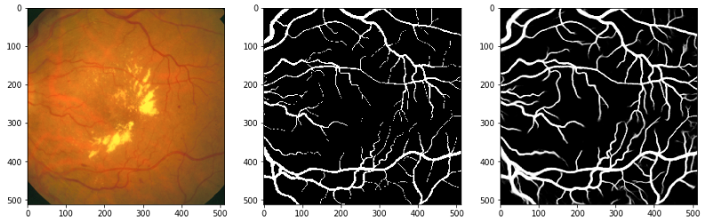

# PyTorch_IterNet
Unofficial PyTorch implementation of IterNet

### Reference
Retinal Image Segmentation Utilizing Structural Redundancy in Vessel Networks\
Li, Liangzhi, et al.\
[[Paper]](https://arxiv.org/abs/1912.05763)
[[Official Implementation]](https://github.com/conscienceli/IterNet)
